# Under Suspicion — Diagrama de Clases UML

```mermaid
classDiagram

  %% ─────────────────────────────────────────
  %% CLASES PRINCIPALES
  %% ─────────────────────────────────────────

  class GameEngine {
    -CaseData caseData
    -int activeSuspectIdx
    -Map suspectState
    -Set askedQuestions
    -Map presentedEvidence
    -Set detectedContradictions
    -NoteEntry[] notebook
    -Map _listeners
    +on(evt, fn) void
    +emit(evt, data) void
    +loadCase(caseId) void
    +getCase() CaseData
    +getEvidence() Evidence[]
    +getSuspects() Suspect[]
    +getNotebook() NoteEntry[]
    +getActiveSuspect() Suspect
    +getActiveSuspectState() SuspectState
    +getSuspectState(id) SuspectState
    +isQuestionAsked(qId) bool
    +isEvidencePresented(suspectId, evId) bool
    +isContradictionDetected(cId) bool
    +getDetectedContradictions() Contradiction[]
    +switchSuspect(index) void
    +askQuestion(questionId) AskResult
    +presentEvidence(evidenceId) EvidenceResult
    +resolveCase(who, how, why) ResolveResult
    -_checkContradictions(suspectId) Contradiction
    -_addNote(type, suspectName, d1, d2) void
  }

  class UIController {
    -GameEngine engine
    -HTMLElement root
    -string activeTab
    -int deskCardZIndex
    -DragState _drag
    -Map screens
    -HTMLElement modal
    -HTMLElement contradictionEl
    -HTMLElement notebookEl
    +showScreen(name) void
    +renderMenu() void
    +renderIntro() void
    +renderGame() void
    +renderResolution() void
    -_buildShell() void
    -_bindGlobalEvents() void
    -_renderSuspectSwitcher() void
    -_renderDesk() void
    -_generateDeskPositions(count) Position[]
    -_onCardPointerDown(e, card) void
    -_onCardPointerMove(e) void
    -_onCardPointerUp(e) void
    -_renderRoom() void
    -_renderPressureBar() void
    -_renderPortrait() void
    -_renderQuestionPanel() void
    -_renderTabContent() void
    -_renderEvidenceGrid(body) void
    -_handleAskQuestion(questionId) void
    -_handlePresentEvidence(evidenceId) void
    -_handleAccuse() void
    -_setDialogue(text) void
    -_showEvidenceModal(evidenceId) void
    -_hideEvidenceModal() void
    -_showContradiction(c) void
    -_renderNotebookPanel() void
    -_toggleNotebook() void
    -_refreshNotebookContent() void
    -_updateNotebookBadge() void
    -_renderResult(result) void
    -_esc(str) string
  }

  %% ─────────────────────────────────────────
  %% ESTRUCTURAS DE DATOS (Case Data)
  %% ─────────────────────────────────────────

  class CaseData {
    +string id
    +string title
    +string subtitle
    +string intro
    +Victim victim
    +Scene scene
    +Suspect[] suspects
    +Evidence[] evidence
    +Contradiction[] contradictions
    +Solution solution
    +Option[] howOptions
    +Option[] whyOptions
    +string correctExplanation
    +string wrongExplanation
  }

  class Suspect {
    +string id
    +string name
    +int age
    +string role
    +string description
    +bool isGuilty
    +QuestionSet questions
    +Map evidenceResponses
  }

  class QuestionSet {
    +Question[] vinculo
    +Question[] coartada
  }

  class Question {
    +string id
    +string text
    +string response
    +int pressureCost
  }

  class Evidence {
    +string id
    +string title
    +string type
    +string icon
    +string shortDesc
    +string fullDesc
    +EvidenceMeta metadata
  }

  class EvidenceMeta {
    +string fecha
    +string fuente
    +string ref
  }

  class Contradiction {
    +string id
    +string suspectId
    +string[] questionIds
    +string evidenceId
    +string statement
    +string proof
    +int suspicionBonus
    +bool isRedHerring
  }

  class Solution {
    +string who
    +string how
    +string why
  }

  class SuspectState {
    +int pressure
    +int suspicion
  }

  class NoteEntry {
    +string type
    +string suspectName
    +string detail1
    +string detail2
    +string time
  }

  class ResolveResult {
    +object correct
    +bool allCorrect
    +int score
    +string rating
    +string ratingLabel
    +int contradictionsFound
    +int totalContradictions
    +string explanation
  }

  %% ─────────────────────────────────────────
  %% RELACIONES
  %% ─────────────────────────────────────────

  UIController --> GameEngine : usa (engine)
  GameEngine --> CaseData : carga y consulta

  CaseData "1" *-- "3" Suspect : contiene
  CaseData "1" *-- "8" Evidence : contiene
  CaseData "1" *-- "n" Contradiction : contiene
  CaseData "1" *-- "1" Solution : contiene

  Suspect "1" *-- "1" QuestionSet : tiene
  QuestionSet "1" *-- "n" Question : agrupa
  Suspect ..> Evidence : responde a (evidenceResponses)

  Evidence "1" *-- "1" EvidenceMeta : metadatos

  Contradiction --> Suspect : referencia (suspectId)
  Contradiction --> Evidence : referencia (evidenceId)
  Contradiction --> Question : requiere (questionIds)

  GameEngine "1" *-- "n" SuspectState : estado runtime
  GameEngine "1" *-- "n" NoteEntry : libreta
  GameEngine ..> ResolveResult : produce

  NoteEntry ..> Suspect : nombra sospechoso
```

## Descripción de relaciones

| Relación | Tipo | Descripción |
|---|---|---|
| `UIController → GameEngine` | Dependencia | El controlador lee estado y dispara acciones sobre el engine |
| `GameEngine → CaseData` | Asociación | El engine carga y consulta datos inmutables del caso |
| `CaseData ◆ Suspect` | Composición | El caso posee sus sospechosos (3 en caso-01) |
| `CaseData ◆ Evidence` | Composición | El caso posee sus pruebas (8 en caso-01) |
| `CaseData ◆ Contradiction` | Composición | El caso define las contradicciones detectables |
| `Suspect ◆ QuestionSet` | Composición | Cada sospechoso tiene sus preguntas de vínculo y coartada |
| `Suspect ⇢ Evidence` | Dependencia | Cada sospechoso tiene respuestas mapeadas por evidenceId |
| `Contradiction → Suspect` | Asociación | Referencia al sospechoso afectado por la contradicción |
| `Contradiction → Evidence` | Asociación | La prueba que desmiente la declaración |
| `GameEngine ◆ SuspectState` | Composición | Estado mutable de presión/sospecha por sospechoso (runtime) |
| `GameEngine ◆ NoteEntry` | Composición | Entradas de la libreta generadas durante el interrogatorio |
| `GameEngine ⇢ ResolveResult` | Dependencia | Objeto resultado producido al llamar `resolveCase()` |

## Tipos de nota en la libreta (`NoteEntry.type`)

| Valor | Cuándo se crea | Generado por |
|---|---|---|
| `briefing` | Al cargar el caso | `loadCase()` |
| `question` | Al hacer una pregunta | `askQuestion()` |
| `evidence` | Al presentar una prueba | `presentEvidence()` |
| `contradiction` | Al detectar contradicción | `_checkContradictions()` |
